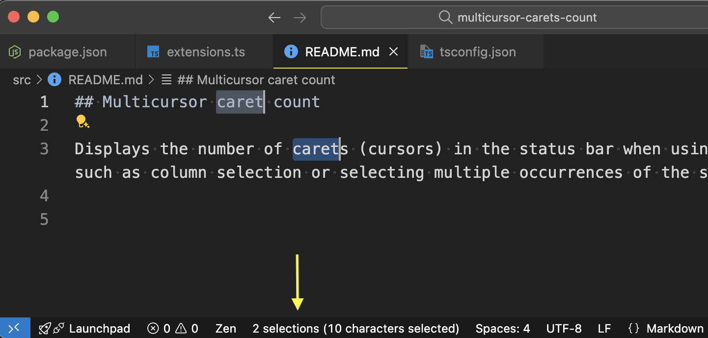

## Multicursor caret count

Displays the number of carets (cursors) in the status bar when using multi-selection features such as column selection or selecting multiple occurrences of the same word.

Get it in [VS Code Marketplace](https://marketplace.visualstudio.com/items?itemName=tsanthosh.multicursor-caret-counter)

### Screenshot

